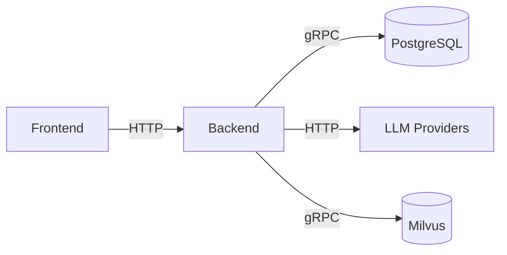

# Software Requirements Specification (SRS) for Document Parsing Platform
## Version 1.1

### 1. Introduction
#### 1.1 Purpose
This SRS outlines requirements for a Document Parsing Platform that:
- Processes multiple document formats including PDF, DOCX, images (JPEG/PNG/TIFF), XLSX, and TXT
- Extracts text, tables, images, and metadata with OCR support for Bangla handwriting
- Provides structured JSON/XML output
- Offers frontend configuration for multiple LLM/embedding providers

#### 1.2 Scope
Key capabilities:
- Document ingestion via upload/API/directory monitoring
- Advanced parsing with OCR (BanglaLekha-Isolated dataset)
- Configurable API integrations (Google AI Studio, Awan LLM, Ollama, etc.)
- Role-based access control

#### 1.3 Definitions
- **OCR**: Optical Character Recognition
- **RAG**: Retrieval-Augmented Generation
- **LLM**: Large Language Model
- **RBAC**: Role-Based Access Control

#### 1.4 References
- BanglaLekha-Isolated Dataset
- Docling/LangChain Documentation
- Provider API docs (Google AI, Awan, etc.)

#### 1.5 Overview
Sections:
- Overall system description
- Functional requirements
- Non-functional requirements
- Integration specifications

### 2. Overall Description
#### 2.1 Product Perspective
Standalone system integrating with:
- Document management systems
- Vector databases (Milvus)
- Multiple AI providers

#### 2.2 Product Functions
Core features:
1. Multi-format document processing
2. Handwriting recognition (Bangla)
3. Frontend API configuration
4. Structured data output

#### 2.3 User Classes
1. **Administrators**:
   - Configure system settings
   - Manage API integrations
   - Monitor processing

2. **Analysts**:
   - Query parsed data
   - Configure analysis pipelines

3. **End Users**:
   - Upload documents
   - View extracted content

#### 2.4 Operating Environment
- **Backend**: Python 3.8+ (Flask)
- **Frontend**: React/Vue.js
- **Database**: PostgreSQL + Milvus
- **Deployment**: Docker/Kubernetes

#### 2.5 Constraints
- Must support offline/local model operation
- No cloud vendor lock-in
- GDPR-compliant data handling

#### 2.6 Assumptions
- Internet available for API calls
- Adequate GPU for OCR processing
- Valid API keys provided for services

### 3. Functional Requirements
#### 3.1 Document Ingestion
- Accept files ≤100MB via:
  - Web upload
  - REST API
  - Filesystem monitoring
- Batch processing (1000 docs/day)

#### 3.2 Format Support
| Format  | Features                  |
|---------|---------------------------|
| PDF     | Text, scanned pages, forms|
| DOCX    | Styles, tables, images    |
| Images  | OCR, handwritten content  |
| XLSX    | Tables, formulas          |
| TXT     | Raw text extraction       |

#### 3.3 Data Extraction
1. **Text**:
   - Paragraphs
   - Headings
   - Lists
   - Handwriting (Bangla)

2. **Structured Data**:
   - Tables → JSON arrays
   - Forms → Key-value pairs

3. **Visual Elements**:
   - Images with captions
   - Charts as SVG+data

#### 3.4 Metadata
Extract:
- Document properties (author, dates)
- System metadata (upload time, user)
- Content statistics (word count, etc.)

#### 3.5 Output Formats
```json
{
  "content": {
    "text": "...",
    "tables": [...],
    "images": [...]
  },
  "metadata": {...}
}
```

#### 3.6 Error Handling
- Invalid files → User notification
- API failures → Automatic retry
- System errors → Admin alerts

#### 3.7 LLM Configuration
**Providers**:
1. Google AI Studio
2. Awan LLM  
3. Ollama (local)
4. OpenRouter
5. TogetherAI
6. LiteLLM
7. LMStudio

**Frontend Controls**:
- Provider selection
- API key management
- Model parameters:
  - Temperature
  - Max tokens
  - Stop sequences

### 4. Non-Functional Requirements
#### 4.1 Performance
- ≤10s processing time (avg)
- Support 100 concurrent users
- 99.9% uptime SLA

#### 4.2 Security
- HTTPS enforcement
- API key encryption
- RBAC implementation

#### 4.3 Reliability
- Automated failover
- Daily backups
- Health monitoring

#### 4.4 Usability
- Intuitive UI/UX
- Contextual help
- Accessibility compliant

### 5. Integration Requirements
#### 5.1 API Architecture


#### 5.2 Provider Requirements
Each integration must support:
- Authentication
- Rate limiting
- Error handling
- Response normalization

#### 5.3 Local Deployment
For Ollama/LMStudio:
- Model path configuration
- GPU resource allocation
- Version compatibility checks

### 6. Appendices
#### 6.1 Sample API Payload
```python
{
  "document": "base64_encoded_file",
  "options": {
    "output_format": "json",
    "ocr_languages": ["eng", "ben"]
  }
}
```

#### 6.2 Error Codes
| Code | Meaning                  |
|------|--------------------------|
| 400  | Invalid input            |
| 403  | Authorization failed     |
| 429  | Rate limit exceeded      |
| 500  | Internal server error    |